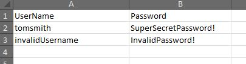
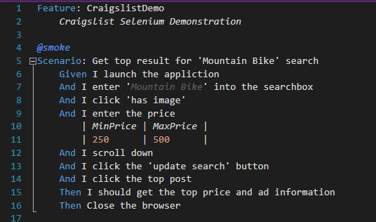

# SeleniumDemo
by Adam De King  

Basic demonstration of Selenium Web Driver with NUnit, using different drivers and different locators. 
Using parallelism to run multiple tests at once. (Currently set to 3)  
API Tests using HttpClient for GET and POST requests.  

## Data Driven Tests
Includes Data Driven test with reading test data from an Excel file.  
 

 

## Specflow Craigslist Demo in Gherkin:  
 
  

## Also includes basic Craigslist test using database lookups:   
(Chrome, Firefox, and Internet Explorer, also in parallel)  
 

 

 
Results are saved to a logging table.  

 

