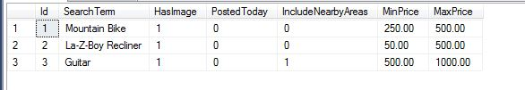
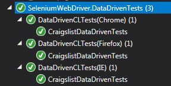
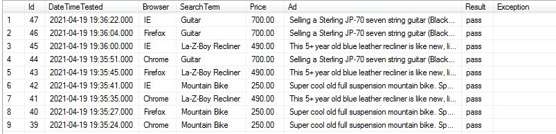

# SeleniumDemo
by Adam De King  

Basic demonstration of Selenium Web Driver with NUnit, using different drivers and different locators. 
Using parallelism to run multiple tests at once. (Currently set to 3)  
Includes Data Driven test with reading test data from an Excel file.  
API Tests using HttpClient for GET and POST requests.  
Database integration for logging.  

## Specflow Craigslist Demo in Gherkin:  
Feature: CraigslistDemo  
	Craigslist Selenium Demonstration  
  
@smoke  
Scenario: Get top result for 'Mountain Bike' search  
	Given I launch the appliction  
	And I enter 'Mountain Bike' into the searchbox  
	And I click 'has image'  
	And I enter the price  
		| MinPrice | MaxPrice |  
		| 250      | 500      |  
	And I scroll down  
	And I click the 'update search' button  
	And I click the top post  
	Then I should get the top price and ad information  
  

## Also includes basic Craigslist test using database lookups:   
(Chrome, Firefox, and Internet Explorer, also in parallel)  
 

 

 
Results are saved to a logging table.  

 

